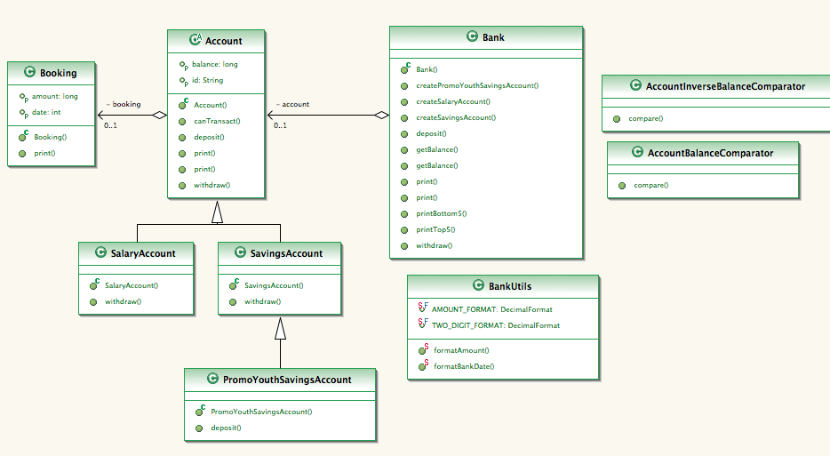
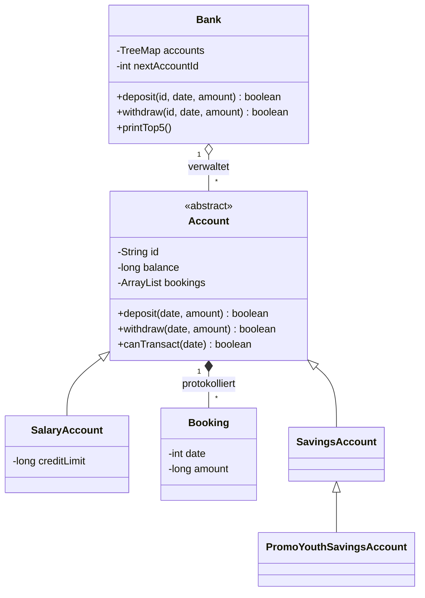

# Banken-Simulation — wie das Ding funktioniert

Notizen aus dem Code (`src/main/java/ch/schule`) und dem Klassendiagramm in `Design/`.

## Worum geht es

Eine Bank verwaltet mehrere Konten. Man kann Konten eröffnen, einzahlen, abheben,
Kontoauszüge drucken und Ranglisten ausgeben. Alles läuft auf der Konsole, nichts
wird gespeichert — nach Programmende ist alles weg.

Trotz Spring-Boot-`pom.xml` ist es reines Java: keine Datenbank, kein Netzwerk.
Genau deshalb lässt es sich so gut testen.

## Zwei Dinge muss man wissen, sonst wundert man sich über die Zahlen

**1. Beträge sind Millirappen, keine Franken.**
100 000 Millirappen = 1 Franken. Warum? Ganzzahlen (`long`) statt `double` — so
gibt es keine Rundungsfehler beim Geld. Erst beim Anzeigen wird durch 100 000
geteilt (`BankUtils.formatAmount`).

**2. Das Datum ist ein `int`: Banktage seit dem 1.1.1970.**
Vereinfachter Kalender — jeder Monat hat 30 Tage, jedes Jahr 360.
Umrechnung in `BankUtils.formatBankDate`:

```
Jahr  = 1970 + tag/360
Monat = 1 + (tag%360)/30
Tag   = 1 + (tag%360)%30      →  13560 = 01.09.2007
```

## Die Klassen

| Klasse | Was sie macht |
|---|---|
| `Bank` | Verwaltet alle Konten, vergibt Kontonummern, leitet Aufträge weiter |
| `Account` | **Abstrakt.** Kontonummer, Saldo, Buchungen, Ein-/Auszahlen, Auszüge |
| `SavingsAccount` | Sparkonto — darf nie ins Minus |
| `SalaryAccount` | Lohnkonto — darf bis zur Kreditlimite ins Minus |
| `PromoYouthSavingsAccount` | Wie Sparkonto, aber 1 % Bonus auf jede Einzahlung |
| `Booking` | Eine Buchung: Datum + Betrag. Unveränderlich |
| `BankUtils` | Nur statische Helfer zum Formatieren |
| `AccountBalanceComparator` | Sortiert absteigend → für `printTop5()` |
| `AccountInverseBalanceComparator` | Sortiert aufsteigend → für `printBottom5()` |
| `Main` | Nur ein Demo-Aufruf, keine Fachlogik |



## Wie das zusammenhängt



**Bank → Account (1:n).** Die Konten liegen in einer `TreeMap`, Schlüssel ist die
Kontonummer. Die Bank kennt die konkreten Typen nur beim Erzeugen — danach
arbeitet sie nur noch mit `Account`. Das ist der Polymorphie-Trick: `deposit()`
ruft automatisch die richtige Variante auf.

**Account → Booking (1:n).** Jede erfolgreiche Transaktion hängt eine `Booking`
an die Liste. Abhebungen werden als **negativer** Betrag gespeichert. Der Saldo
läuft zusätzlich als Feld mit — redundant, aber schnell.

**Die Regeln stecken in den Unterklassen**, nicht in `Account`:

| Klasse | Regel beim Abheben / Einzahlen |
|---|---|
| `Account` | Kennt **keine** Limite. Prüft nur: Betrag ≥ 0 und Datum nicht rückwärts |
| `SavingsAccount` | `balance < amount` → ablehnen. Saldo 0 ist noch erlaubt |
| `SalaryAccount` | `balance - amount < creditLimit` → ablehnen |
| `PromoYouthSavingsAccount` | Rechnet `amount + amount/100`, dann weiter nach oben |

Alle Unterklassen rufen am Schluss `super` — die Grundprüfungen greifen also immer.

### Kontonummern

Ein Zähler pro Bank, startet bei **1000**. Das Präfix zeigt den Typ:
`S-` Sparkonto, `Y-` Jugendsparkonto, `P-` Lohnkonto.
Der Zähler ist typübergreifend: `S-1000`, `S-1001`, `Y-1002`, `P-1003`.

### Was bei einer Einzahlung passiert

1. `Bank.deposit(id, date, amount)` sucht das Konto. Nicht da → `false`.
2. `Account.deposit(date, amount)` prüft: Betrag negativ? → `false`.
3. `canTransact(date)`: Datum älter als die letzte Buchung? → `false`.
4. Sonst: Saldo anpassen, `Booking` anhängen, `true`.

Die Bank prüft also nur die Existenz, die Fachregeln prüft das Konto selbst.
Und: **Fehler kommen als `false` oder `null` zurück, nie als Exception.**
Wer den Rückgabewert ignoriert, merkt einen Fehlschlag gar nicht.

### Warum `canTransact()` wichtiger ist, als es aussieht

Die Regel "kein Rückdatieren" sorgt dafür, dass die Buchungsliste **immer
chronologisch** ist. Genau darauf verlässt sich `print(year, month)`: die Schleife
bricht mit `break` ab, sobald eine Buchung nach dem gesuchten Monat liegt. Ohne
diese Sortierung wäre der Monatsauszug falsch.

### Ausgaben

Alles geht direkt auf `System.out`, ohne Rückgabewert. Zum Testen muss man den
Output umleiten — dafür gibt es die Hilfsklasse `ConsoleOutput` in den Tests.

* `print()` — ganzer Auszug. Der laufende Saldo wird aus den Buchungen **neu
  aufsummiert**, nicht aus dem Saldo-Feld gelesen.
* `print(year, month)` — nur ein Monat, aber der Saldo wird trotzdem von Anfang an
  mitgerechnet, damit die Startzahl stimmt.
* `printTop5()` / `printBottom5()` — sortieren eine Kopie und geben max. 5 Zeilen aus.

---

## Stolperfallen

Aufgefallen beim Durcharbeiten. Der Produktivcode wurde **bewusst nicht
korrigiert** — er ist ja der Testgegenstand. Die Tests halten das *tatsächliche*
Verhalten fest und kommentieren es.

1. **`Bank.getBalance()` liefert die Summe negativ.** Die Schleife rechnet
   `balance -= ...`. Bei 12 000 + 8 000 kommt **-20 000** heraus. Entweder gewollt
   (Kundenguthaben sind aus Banksicht Schulden) oder ein Vorzeichenfehler — ohne
   Anforderungsdokument nicht entscheidbar. Steht so kommentiert in `BankTests`.

2. **Tote Felder.** `Account.booking` und `Bank.account` haben Getter/Setter,
   werden aber nie benutzt. Überbleibsel aus dem UML-Werkzeug (siehe die
   `@uml.property`-Tags). Die echten Daten liegen in `bookings` und `accounts`.
   Das Diagramm zeigt hier also etwas, das es im Code so nicht gibt.

3. **`Main` legt gar kein Lohnkonto an.** `createSalaryAccount(12000)` übergibt
   eine *positive* Limite → die Methode gibt `null` zurück. Fällt niemandem auf,
   weil der Rückgabewert nicht geprüft wird.

4. **Der 1-%-Bonus verschwindet bei Kleinbeträgen.** `amount / 100` ist
   Integer-Division: unter 100 Millirappen ist der Bonus 0.

5. **Negative Beträge wären eine Hintertür.** Ohne die `amount < 0`-Prüfung könnte
   man sich per "negativer Abhebung" Geld gutschreiben. Achtung: `SalaryAccount`
   prüft **zuerst** die Limite — ein negativer Betrag rutscht dort durch und wird
   erst in `Account.withdraw()` gestoppt.

6. **Die Grenzwerte sind einschliessend.** Sparkonto: der ganze Saldo darf weg
   (0 ist ok). Lohnkonto: genau bis zur Limite ja, ein Millirappen mehr nein.
   Klassische Off-by-one-Kandidaten → je ein eigener Test.

7. **`DecimalFormat` hängt an der Locale des Rechners** (`1.20` vs. `1,20`).
   Tests dürfen das Trennzeichen darum nicht fest verdrahten, sonst sind sie auf
   dem einen Rechner grün und auf dem anderen rot.

---

## Aufgabe 4 — die Tests

| Testklasse | Fokus |
|---|---|
| `AccountTests` | Grundverhalten, über eine eigene Test-Unterklasse |
| `SavingsAccountTests` | Grenzwerte rund um Saldo 0 |
| `SalaryAccountTests` | Grenzwerte rund um die Kreditlimite |
| `PromoYouthSavingsAccountTests` | Bonus und Integer-Division |
| `BankTests` | Kontonummern, unbekannte IDs, Ranglisten |
| `BookingTests` | Wertobjekt und Buchungszeile |
| `BankUtilsTests` | Datums- und Betragsformatierung |
| `AccountComparatorTests` | Sortierreihenfolge |
| `ConsoleOutput` | *(kein Test)* — leitet `System.out` um |

Verwendete Verfahren aus dem Modul:

* **Äquivalenzklassen** — gültiger / negativer / Null-Betrag, bekannte / unbekannte
  Kontonummer.
* **Grenzwertanalyse** — Saldo-1 / Saldo / Saldo+1, Limite genau erreicht / um 1
  überschritten, Bonus bei 99 / 100.
* **Zustandsbasiert** — `canTransact()` vor und nach der ersten Buchung.
* **Negativtests** — jede Methode auch mit ungültigen Eingaben.

**Ergebnis: 92 Tests, 100 % Lines und 100 % Branches** über alle neun Klassen
(ohne `Main`, das ist in der `pom.xml` ausgenommen).

```
./mvnw test          # Report: target/site/jacoco/index.html
./mvnw verify        # bricht ab, wenn Coverage unter 80 % / 75 % fällt
```
