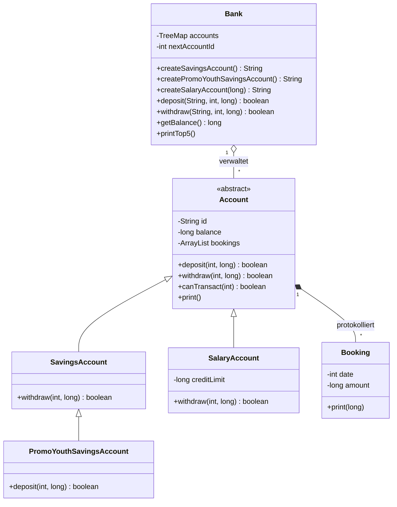
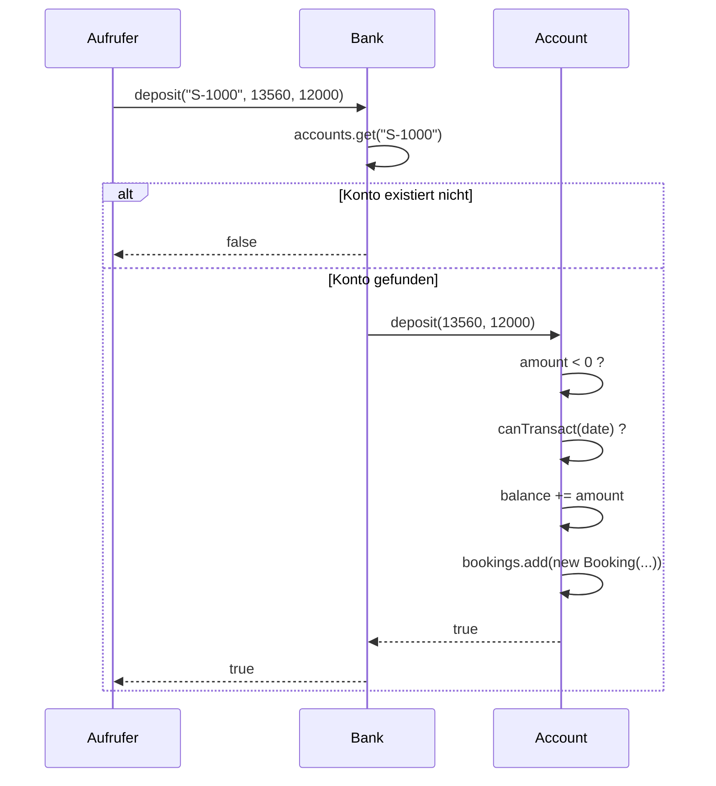

# Aufgabe 3 — Banken-Simulation: Wie die Software funktioniert

Dokumentation in Stichworten, erarbeitet aus dem Quellcode unter
`src/main/java/ch/schule` und dem Klassendiagramm in `Design/`.

## Zweck der Software

* Simuliert eine Bank mit mehreren Konten unterschiedlichen Typs.
* Kann Konten eröffnen, Geld ein- und auszahlen, Kontoauszüge drucken und
  Ranglisten der Konten ausgeben.
* Reine Konsolen-Anwendung, keine Persistenz — alles lebt im Arbeitsspeicher und
  ist nach Programmende weg.
* Kein Spring, keine Datenbank, kein Netzwerk: trotz Spring-Boot-`pom.xml` ist es
  ein reines Java-SE-Programm. Ideal für Unit-Tests, weil es keine externen
  Abhängigkeiten gibt.

## Fachliche Grundbegriffe (wichtig, sonst versteht man die Zahlen nicht)

* **Beträge sind Millirappen** (`long`), nicht Franken.
  * 100 000 Millirappen = 1 Franken.
  * Grund: Ganzzahlen statt `double` → keine Rundungsfehler beim Rechnen mit Geld.
  * `BankUtils.formatAmount()` teilt beim Anzeigen durch 100 000.
* **Datum ist ein `int`: "Banktage seit dem 1.1.1970"**.
  * Vereinfachtes Kalendermodell: jeder Monat hat 30 Tage, jedes Jahr 360 Tage.
  * Umrechnung in `BankUtils.formatBankDate()`:
    `Jahr = 1970 + tag/360`, `Monat = 1 + (tag%360)/30`, `Tag = 1 + (tag%360)%30`.
  * Beispiel: `13560` → 01.09.2007, `13576` → 17.09.2007.

## Die Klassen im Überblick

| Klasse | Rolle | Kernaussage |
|---|---|---|
| `Bank` | Fassade / Verwaltung | Hält alle Konten in einer `TreeMap<String, Account>`, vergibt Kontonummern, leitet Aufträge ans richtige Konto weiter |
| `Account` | **abstrakte** Basisklasse | Kontonummer, Saldo, Buchungsliste, Ein-/Auszahlen, Kontoauszüge |
| `SavingsAccount` | Sparkonto | Überschreibt `withdraw()`: darf nie ins Minus |
| `SalaryAccount` | Lohnkonto | Überschreibt `withdraw()`: darf bis zur Kreditlimite ins Minus |
| `PromoYouthSavingsAccount` | Promo-Jugendsparkonto | Erbt von `SavingsAccount`, überschreibt `deposit()`: 1 % Bonus |
| `Booking` | Buchung (Wertobjekt) | Datum + Betrag, unveränderlich, kann sich selbst als Zeile drucken |
| `BankUtils` | Hilfsklasse (nur statisch) | Formatiert Datum und Beträge |
| `AccountBalanceComparator` | Sortierregel | Nach Saldo **absteigend** — für `printTop5()` |
| `AccountInverseBalanceComparator` | Sortierregel | Nach Saldo **aufsteigend** — für `printBottom5()` |
| `Main` | Demo-Einstieg | Nur ein Beispielaufruf, keine Fachlogik |

## Die Zusammenhänge

* **Bank → Account: Aggregation, 1 zu n.**
  * Speicher: `TreeMap<String, Account>`, Schlüssel ist die Kontonummer.
  * Die `TreeMap` hält die Konten automatisch nach Kontonummer sortiert.
  * Die Bank kennt die Kontotypen nur beim **Erzeugen**; danach arbeitet sie
    ausschliesslich über den Typ `Account` → Polymorphie.
* **Account → Booking: Komposition, 1 zu n.**
  * Jede erfolgreiche Transaktion hängt eine `Booking` an die `ArrayList` an.
  * Abhebungen werden als Buchung mit **negativem** Betrag gespeichert.
  * Der Saldo wird zusätzlich als Feld mitgeführt (redundant zur Buchungsliste,
    aber schnell).
* **Vererbung: die Regeln liegen in den Unterklassen.**
  * `Account` selbst kennt **keine** Limite — der Saldo dürfte beliebig negativ werden.
  * `SavingsAccount.withdraw()`: `getBalance() < amount` → ablehnen.
  * `SalaryAccount.withdraw()`: `getBalance() - amount < creditLimit` → ablehnen.
  * `PromoYouthSavingsAccount.deposit()`: rechnet `amount + amount/100` und ruft
    dann `super.deposit()`.
  * Alle Unterklassen rufen am Schluss `super`, d.h. die Grundprüfungen
    (negativer Betrag, Datumsreihenfolge) gelten **immer**.

### Kontonummern-Vergabe

* Ein Zähler `nextAccountId` pro Bank-Objekt, startet bei **1000**.
* Präfix zeigt den Typ: `S-` Sparkonto, `Y-` Promo-Jugendsparkonto, `P-` Lohnkonto.
* Der Zähler ist **typübergreifend**: `S-1000`, `S-1001`, `Y-1002`, `P-1003`.
* Zwei `Bank`-Objekte zählen unabhängig — beide beginnen bei 1000.

### Typischer Ablauf einer Einzahlung

* **Zwei Prüfstufen:** die Bank prüft nur, ob das Konto existiert. Die fachlichen
  Regeln prüft das Konto selbst.
* **Rückgabewert statt Exception:** die ganze Anwendung meldet Fehler mit
  `false` bzw. `null`. Es wird nirgends eine Exception geworfen. Wer den
  Rückgabewert ignoriert, merkt einen Fehlschlag nicht.

### Regel "keine Rückdatierung": `canTransact()`

* Vor jeder Transaktion prüft `Account.canTransact(date)`, ob das Datum
  **grösser oder gleich** dem Datum der letzten Buchung ist.
* Ohne Buchungen ist jedes Datum erlaubt.
* Folge: die Buchungsliste ist immer chronologisch sortiert.
* Genau darauf verlässt sich `print(year, month)`: es bricht die Schleife mit
  `break` ab, sobald eine Buchung nach dem gesuchten Monat liegt.

### Ausgaben

* Alle Ausgaben gehen direkt auf `System.out` — es gibt keinen Rückgabewert.
  Zum Testen muss der Standard-Output umgeleitet werden (siehe
  `src/test/java/.../ConsoleOutput.java`).
* `Account.print()` — vollständiger Kontoauszug, mit laufendem Saldo, der aus den
  Buchungen **neu aufsummiert** wird (nicht aus dem Saldo-Feld).
* `Account.print(year, month)` — nur die Buchungen eines Monats; der laufende
  Saldo wird trotzdem von Anfang an mitgerechnet, damit die Startzahl stimmt.
* `Bank.printTop5()` / `printBottom5()` — kopiert die Konten in ein Array,
  sortiert es mit dem jeweiligen Comparator und gibt maximal 5 Zeilen im Format
  `S-1000: 6000` aus.

---

## Stolperfallen im Code

Diese Punkte sind beim Durcharbeiten aufgefallen. Der Produktivcode wurde
**bewusst nicht korrigiert** — er ist der Testgegenstand. Die Tests
dokumentieren das *tatsächliche* Verhalten und markieren es im Kommentar.

1. **`Bank.getBalance()` liefert die negative Summe.**
   Die Schleife rechnet `balance -= aa[i].getBalance()`. Bei zwei Konten mit
   12 000 und 8 000 kommt **-20 000** heraus, nicht 20 000.
   Zwei Lesarten: (a) gewollt — aus Sicht der Bank sind Kundenguthaben
   Verbindlichkeiten, gehören also auf die Passivseite; (b) schlicht ein
   Vorzeichenfehler. Ohne Anforderungsdokument nicht entscheidbar → in
   `BankTests.testBalance()` festgehalten und kommentiert.

2. **Tote Felder aus dem UML-Werkzeug.**
   `Account.booking` und `Bank.account` sind einzelne Referenzen mit
   Gettern/Settern, die von der Fachlogik **nie** benutzt werden. Sie stammen
   aus dem Round-Trip-Tool (siehe die `@uml.property`-Tags in den Kommentaren).
   Die echten Daten liegen in `bookings` (ArrayList) und `accounts` (TreeMap).
   Im Klassendiagramm erscheinen sie als `0..1`-Assoziationen — das Diagramm
   bildet an dieser Stelle also nicht die tatsächliche Struktur ab.

3. **`Main` funktioniert nicht wie erwartet.**
   `ubs.createSalaryAccount(12000)` übergibt eine **positive** Limite. Die
   Methode gibt darauf `null` zurück und legt kein Konto an — stillschweigend,
   weil der Rückgabewert nicht geprüft wird.

4. **Der 1-%-Bonus verschwindet bei Kleinbeträgen.**
   `long bonus = amount / 100` ist eine Integer-Division. Unter 100 Millirappen
   ist der Bonus 0. Bei einer Einzahlung von 99 wird also nichts gutgeschrieben.

5. **Negative Beträge als Hintertür.**
   Ohne die Prüfung `amount < 0` in `Account.deposit()`/`withdraw()` könnte man
   sich per "negativer Abhebung" Geld gutschreiben. Wichtig: `SalaryAccount`
   prüft **zuerst** die Kreditlimite — ein negativer Betrag kommt dort problemlos
   durch und wird erst in `Account.withdraw()` abgefangen.

6. **Comparatoren arbeiten mit `Comparator<Object>` statt `Comparator<Account>`.**
   Alter Stil aus der Zeit vor Generics, mit `cast` im Rumpf. Ein
   Nicht-`Account`-Objekt führt zur `ClassCastException` statt zu einem
   Compiler-Fehler.

7. **Grenzfälle der Limiten sind "einschliessend".**
   `SavingsAccount`: der gesamte Saldo darf abgehoben werden (Saldo 0 ist ok).
   `SalaryAccount`: genau bis auf die Kreditlimite ist erlaubt, ein Millirappen
   mehr nicht. Das sind die klassischen Off-by-one-Kandidaten und deshalb je ein
   eigener Testfall.

8. **Locale-Abhängigkeit bei der Formatierung.**
   `BankUtils.AMOUNT_FORMAT` ist ein `DecimalFormat`, das die Symbole der
   **Standard-Locale des Rechners** verwendet (`1.20` in der Schweiz, `1,20` in
   Deutschland). Tests dürfen das Trennzeichen darum nicht fest verdrahten,
   sonst sind sie auf dem einen Rechner grün und auf dem anderen rot.

---

## Aufgabe 4 — Was daraus für die Tests folgt

| Testklasse | Testet | Fokus |
|---|---|---|
| `AccountTests` | `Account` (über eine eigene Test-Unterklasse) | Grundverhalten ohne Limiten-Regeln |
| `SavingsAccountTests` | `SavingsAccount` | Grenzwerte rund um Saldo 0 |
| `SalaryAccountTests` | `SalaryAccount` | Grenzwerte rund um die Kreditlimite |
| `PromoYouthSavingsAccountTests` | `PromoYouthSavingsAccount` | Bonus-Berechnung, Integer-Division |
| `BankTests` | `Bank` | Kontonummern, unbekannte IDs, Ranglisten |
| `BookingTests` | `Booking` | Wertobjekt und Buchungszeile |
| `BankUtilsTests` | `BankUtils` | Datums- und Betragsformatierung |
| `AccountComparatorTests` | beide Comparatoren | Sortierreihenfolge, Rückgabewerte |
| `ConsoleOutput` | *(kein Test)* | Hilfsklasse, die `System.out` umleitet |

Angewandte Testentwurfsverfahren aus dem Modul:

* **Äquivalenzklassen**: gültiger Betrag / negativer Betrag / Betrag 0;
  existierende Kontonummer / unbekannte Kontonummer.
* **Grenzwertanalyse**: Abhebung von Saldo-1 / Saldo / Saldo+1; Kreditlimite
  genau erreicht / um 1 überschritten; Bonus bei 99 / 100 Millirappen.
* **Zustandsbasiert**: `canTransact()` vor und nach der ersten Buchung.
* **Negativtests**: jede Methode wird auch mit ungültigen Eingaben aufgerufen.

**Erreichte Coverage: 100 % Lines, 100 % Branches** über alle neun
Produktivklassen (ohne `Main`). Report nach `mvnw test` unter
`target/site/jacoco/index.html`.
