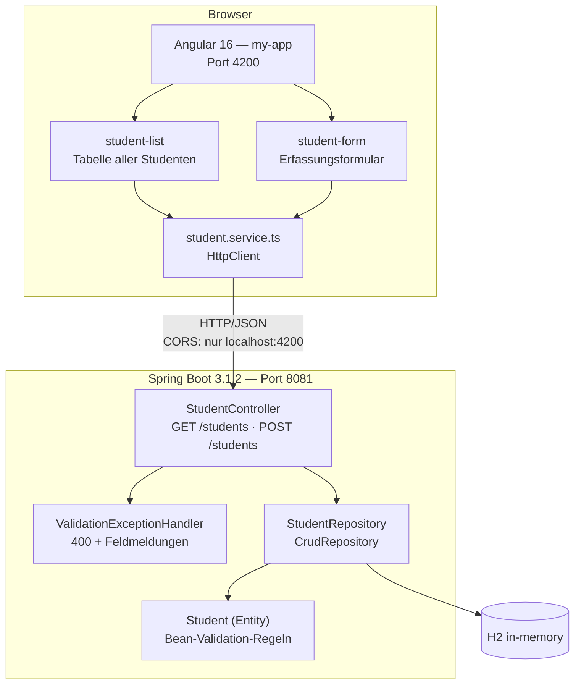

# Testkonzept — Student-Verwaltung

> Angewandtes Testkonzept nach **IEEE 829** zum Kapitel
> [Welche Elemente braucht es für ein Testkonzept?](README.md)
>
> **Testobjekt:** die Student-App aus [`../5-automation-testing/`](../5-automation-testing/README.md)
> **Stand:** 07.09.2026
> **Autor:** Leon Wulff, TBZ Modul 450

Die Gliederung folgt **exakt** den Abschnitten des Kapitels, damit die Zuordnung
Theorie → Anwendung nachvollziehbar bleibt. Alle Zahlen, Testfälle und Befunde
stammen aus tatsächlich durchgeführten Läufen, die in Kapitel 5 dokumentiert sind;
was nicht belegt ist, steht als Annahme im Abschnitt [12](#12--abgrenzung-und-annahmen).

<!-- TOC -->
- [1 Introduction](#1--introduction)
- [2 Test Items](#2--test-items)
- [3 Features to be tested](#3--features-to-be-tested)
- [4 Features not to be tested](#4--features-not-to-be-tested)
- [5 Approach](#5--approach)
- [6 Item pass / fail criteria](#6--item-pass--fail-criteria)
- [7 Test Deliverables](#7--test-deliverables)
- [8 Testing Tasks](#8--testing-tasks)
- [9 Environmental Needs](#9--environmental-needs)
- [10 Schedule](#10--schedule)
- [11 Weitere Elemente](#11--weitere-elemente)
- [12 Abgrenzung und Annahmen](#12--abgrenzung-und-annahmen)
<!-- TOC -->

---

## 1  Introduction

Die **Student-Verwaltung** ist eine kleine Webanwendung, mit der Studenten erfasst
und aufgelistet werden. Sie besteht aus einem Angular-Frontend und einem
Spring-Boot-Backend mit REST-Schnittstelle und einer H2-In-Memory-Datenbank.

Fachlich kann die Anwendung genau zwei Dinge: **alle Studenten anzeigen** und
**einen neuen Studenten erfassen**. Ein Student besteht aus `id`, `name` und
`email`. Beim Start legt ein `CommandLineRunner` fünf Datensätze an (Jonas,
Patrick, Yves, Peter, Ann); nach jedem Neustart ist der Stand wieder frisch, weil
die Datenbank nur im Arbeitsspeicher lebt.

| | |
|---|---|
| Zweck | Schulanwendung des Moduls 450 als Testobjekt für automatisierte Tests |
| Nutzergruppe | Studierende und Lehrperson; kein Produktivbetrieb, keine echten Personendaten |
| Quelle | Vorgabe `spring-boot-angular-basic`, erweitert um das Feature „Eingabevalidierung" |
| Repository-Pfad | `5-automation-testing/spring-boot-angular-basic-lw2/` |

Die Anwendung ist damit bewusst klein. Das ist für dieses Konzept ein Vorteil: der
Umfang lässt sich vollständig erfassen, statt exemplarisch zu bleiben.

---

## 2  Test Items

### 2.1  Architekturskizze



### 2.2  Liste der Test Items

| ID | Test Item | Datei / Pfad | Rolle |
|---|---|---|---|
| TI-1 | `StudentApplication` | `.../tools/StudentApplication.java` | Einstiegspunkt, Seed-Daten über `CommandLineRunner` |
| TI-2 | `StudentController` | `.../controller/StudentController.java` | REST-Schnittstelle, CORS-Regel |
| TI-3 | `ValidationExceptionHandler` | `.../controller/ValidationExceptionHandler.java` | Übersetzt Validierungsfehler in 400 + `fields` |
| TI-4 | `Student` (Entity) | `.../repository/entities/Student.java` | Datenmodell und Validierungsregeln |
| TI-5 | `StudentRepository` | `.../repository/StudentRepository.java` | Datenzugriff (`CrudRepository`) |
| TI-6 | `student-list` | `.../my-app/src/app/student-list/` | Liste im GUI |
| TI-7 | `student-form` | `.../my-app/src/app/student-form/` | Erfassungsformular inkl. Meldungslogik |
| TI-8 | `student.service.ts` | `.../my-app/src/app/service/` | HTTP-Anbindung des Frontends |
| TI-9 | Routing | `.../my-app/src/app/app-routing.module.ts` | Navigation `/students`, `/addstudents` |
| TI-10 | H2-Datenbank | in-memory, kein Schema-File | Persistenz während der Laufzeit |

Alle Pfade relativ zu `5-automation-testing/spring-boot-angular-basic-lw2/src/main/`
bzw. `.../java/ch/tbz/m450/testing/tools/`.

---

## 3  Features to be tested

Aus den Test Items abgeleitet. Die Spalte **Belegt durch** verweist auf real
existierende und ausgeführte Testfälle.

| ID | Feature | Test Item | Stufe | Belegt durch |
|---|---|---|---|---|
| F-01 | Alle Studenten lesen, Antwortformat und Contract (`id`, `name`, `email`) | TI-2, TI-5 | API | `students.api.spec.ts` — *antwortet mit JSON und haelt den Contract ein* |
| F-02 | Seed-Daten sind nach dem Start vorhanden | TI-1 | API | `students.api.spec.ts` — *enthaelt die fuenf Studenten* |
| F-03 | Student anlegen, id-Vergabe durch die Datenbank | TI-2, TI-4 | API | `students.api.spec.ts` — *legt einen Studenten an* |
| F-04 | Umgang mit unbekannten Feldern und mitgeschickter id | TI-2 | API | `students.api.spec.ts` — *ignoriert eine mitgeschickte id* |
| F-05 | Fehlerhafte Anfragen (kaputtes JSON → 400, falscher Content-Type → 415) | TI-2 | API | `students.api.spec.ts` — *lehnt kaputtes JSON ... ab* |
| F-06 | CORS: Port 4200 erlaubt, fremde Origin nicht | TI-2 | API | `students.api.spec.ts` — *erlaubt Port 4200* |
| F-07 | Nicht implementierte Routen antworten mit 404 | TI-2 | API | `students.api.spec.ts` — *alles andere ist 404* |
| F-08 | Pflichtfelder: leere Werte werden mit 400 abgelehnt | TI-3, TI-4 | API | `students.api.spec.ts` — *lehnt leere Werte ... ab* |
| F-09 | Feldgenaue Meldungen — nur das falsche Feld wird gemeldet | TI-3 | API | `students.api.spec.ts` — *meldet nur das Feld, das tatsaechlich falsch ist* |
| F-10 | Längenregel `@Size(max = 100)` auf `name` | TI-4 | API | `students.api.spec.ts` — *lehnt einen zu langen Namen ... ab* |
| F-11 | Bei Ablehnung wird nichts gespeichert | TI-3, TI-5 | API | `students.api.spec.ts` — *speichert nichts bei Ablehnung* |
| F-12 | Navigation und Routing im GUI | TI-9 | E2E | `students.e2e.spec.ts` — *die Startseite verlinkt auf Liste und Formular* |
| F-13 | Liste zeigt Backend-Daten in den richtigen Spalten | TI-6 | E2E | `students.e2e.spec.ts` — *zeigt die Daten aus dem Backend* |
| F-14 | E-Mail als `mailto:`-Link | TI-6 | E2E | `students.e2e.spec.ts` — *zeigt die E-Mail als mailto-Link* |
| F-15 | Submit-Sperre bis beide Felder ausgefüllt sind | TI-7 | E2E | `students.e2e.spec.ts` — *der Submit-Button ist erst mit beiden Feldern aktiv* |
| F-16 | Durchstich Formular → Liste → API | TI-6…TI-10 | E2E | `students.e2e.spec.ts` — *ein erfasster Student landet in der Liste und in der Datenbank* |
| F-17 | Persistenz über einen Reload hinweg | TI-10 | E2E | `students.e2e.spec.ts` — *nach dem Neuladen ist der Student noch da* |
| F-18 | Meldungslogik: keine Meldung auf dem leeren Formular, Meldung nach dem Leeren | TI-7 | E2E | `students.e2e.spec.ts` — *die Meldung steht nicht auf dem leeren Formular* |
| F-19 | E-Mail-Format im Client | TI-7 | E2E | `students.e2e.spec.ts` — *ein ungueltiges E-Mail-Format wird gemeldet* |
| F-20 | Anzeige von Backend-Fehlern, die der Client nicht selbst erkennt | TI-3, TI-7 | E2E | `students.e2e.spec.ts` — *zeigt Backend-Fehler an* |
| F-21 | Antwortzeit- und Fehlerverhalten unter Last | TI-2, TI-5, TI-10 | Last | `students-load.js`, drei Szenarien |
| F-22 | Der Spring-Kontext startet vollständig | alle Backend-Items | Integration | `StudentApplicationTests.contextLoads()` |

**Zuordnung Test Item → Feature**, wie im Lernziel des Kapitels verlangt: jedes
Test Item aus Abschnitt 2.2 kommt in mindestens einem Feature vor. TI-1 in F-02,
TI-2 in F-01…F-07, TI-3 in F-08…F-11 und F-20, TI-4 in F-03/F-08/F-10, TI-5 in
F-01/F-11/F-21, TI-6 in F-13/F-14/F-16, TI-7 in F-15/F-18…F-20, TI-8 implizit in
jedem E2E-Durchstich, TI-9 in F-12, TI-10 in F-17/F-21.

---

## 4  Features not to be tested

| Nicht getestet | Begründung |
|---|---|
| Spring Data JPA und Hibernate selbst (`save`, `findAll`) | Framework-Code. Ein Test dafür wird rot, wenn Spring sich ändert, und sagt nichts über unseren Code |
| Angular-Framework, Routing-Mechanik als solche | dito — geprüft wird nur *unsere* Routenkonfiguration (F-12) |
| Lombok-generierter Bytecode (`@Data`, `@AllArgsConstructor`) | Bibliotheksverhalten |
| Browser-Kompatibilität | Getestet wird ausschliesslich Chromium (`devices['Desktop Chrome']`). Firefox, WebKit und mobile Viewports sind nicht Teil der Konfiguration |
| Barrierefreiheit (WCAG), Usability | keine Anforderung formuliert, kein Werkzeug im Einsatz |
| Sicherheit im engeren Sinn (Authentifizierung, Autorisierung, Penetrationstests) | Die Anwendung hat kein Benutzerkonzept. Getestet wird lediglich die CORS-Regel (F-06) |
| Dauerlast / Soak-Tests über Stunden | Die drei k6-Szenarien laufen 10 s bis 56 s. Alterungseffekte wie Memory Leaks werden dadurch nicht sichtbar |
| Verhalten bei Datenbankausfall | H2 läuft in-memory im selben Prozess; ein isolierter DB-Ausfall ist nicht herstellbar |
| Migration / Schema-Evolution | kein Schema-File, kein Flyway/Liquibase — die Tabelle entsteht bei jedem Start neu |

Nicht getestet **im Sinne von: noch offen** — siehe auch Abschnitt 8.1:

* Die Angular-Komponententests sind nur das CLI-Gerüst (`app.component.spec.ts`
  mit 3, `student-list.component.spec.ts` mit 1 Testblock) und wurden im Rahmen von
  Kapitel 5 **nicht ausgeführt**.
* Auf der Backend-Seite existiert ausser `contextLoads()` **kein** Unit-Test.

---

## 5  Approach

Getestet wird auf mehreren Stufen mit jeweils dem Werkzeug, das für die Stufe
passt. Die Auswahl ist in Kapitel 5 begründet und hier zusammengefasst:

| Stufe | Methode | Werkzeug | Warum dieses |
|---|---|---|---|
| Komponente / Unit | White-Box, isoliert | JUnit 5, Mockito | Standard im Spring-Umfeld; Abhängigkeiten werden durch Test Doubles ersetzt (Vorgehen aus [Kapitel 4](../4-abhaengigkeiten-zu-schnittstellen/README.md)) |
| Schnittstelle / API | Black-Box gegen HTTP | Playwright (`request`-Fixture) | Reiner HTTP-Client ohne Browser. **Ein** Werkzeug deckt API und E2E ab, gemeinsamer Report, Tests sind lesbares TypeScript statt generiertes JSON. Nachteil ehrlich benannt: Postman ist zum interaktiven Erkunden bequemer |
| System / E2E | Black-Box über das GUI | Playwright, Chromium | Automatisches Warten auf Elemente — die `sleep()`-Aufrufe, die Selenium-Tests unzuverlässig machen, entfallen. Es wird **nichts gemockt**: echter Browser → echtes Angular → echtes Backend → echte DB |
| Last / Performance | nicht-funktional | k6 v2.2.0 | Ein JS-Skript ist im Pull Request reviewbar, eine `.jmx`-Datei nicht. Ein Binary, kein JDK, keine GUI |

**Grundsätze, die für alle Stufen gelten:**

1. **Keine Prüfung auf exakte Datensatzzahlen.** Die Tests legen echte Daten an;
   ein `toHaveLength(5)` wäre beim zweiten Lauf rot. Überall „enthält" statt
   „ist gleich", mit pro Lauf eindeutigen Namen (`Ada-1756738-x7k2q`).
2. **Den Contract mitprüfen, nicht nur den Statuscode.**
   `expect(Object.keys(student).sort()).toEqual(['email','id','name'])` schlägt an,
   sobald jemand ein Feld ergänzt oder umbenennt.
3. **Selektoren über die Rolle** (`getByRole('button', { name: 'Submit' })`) statt
   über CSS-Klassen — das überlebt ein Umgestalten des Layouts.
4. **Ist-Zustand zuerst festhalten, dann korrigieren.** Gefundene Fehler wurden
   erst als Test auf das tatsächliche Verhalten dokumentiert und anschliessend
   behoben (siehe Bonus-Feature).

---

## 6  Item pass / fail criteria

### 6.1  Wann gilt ein Test als bestanden?

| Stufe | Bestanden, wenn | Fehlgeschlagen, wenn |
|---|---|---|
| API / E2E | Alle `expect`-Zusicherungen treffen zu; Playwright meldet den Lauf grün | Mindestens eine Zusicherung schlägt fehl, oder ein Test läuft in den Timeout |
| Last | **Alle** k6-Thresholds eingehalten (Exit-Code 0) | Ein Threshold gerissen → k6 endet mit Exit-Code **99**, die Pipeline wird rot |
| Integration | Der Spring-Kontext startet fehlerfrei | Kontext startet nicht → alle abhängigen Tests gelten als fehlgeschlagen |

Die Lastkriterien sind im Skript als maschinell prüfbare Schwellen hinterlegt:

```js
thresholds: {
  http_req_failed:   ['rate<0.01'],              // unter 1 % Fehler
  http_req_duration: ['p(95)<500', 'p(99)<1000'],
  checks:            ['rate>0.99'],
  lese_dauer:        ['p(95)<300'],              // eigene Metrik
  schreib_dauer:     ['p(95)<600'],
}
```

**Abnahmekriterium für die Gesamtlösung:** alle funktionalen Tests grün **und**
alle Lastszenarien innerhalb der Thresholds. Zuletzt erreicht: `20 passed (5.5s)`
(11 API + 9 E2E) sowie smoke/load/stress mit je „alle Thresholds OK".

### 6.2  Fehlerklassifikation

Nach der Einteilung des Kapitels:

| Klasse | Definition | Umgang |
|---|---|---|
| **Geringfügig** | Die Applikation läuft, hat aber gewisse Mängel | Dokumentieren, Behebung optional |
| **Mittelschwer** | Die Applikation hat offensichtliche Fehler | Muss behoben werden, blockiert die Abnahme aber nicht zwingend |
| **Schwerwiegend** | Die Applikation stürzt ab | Sofortige Behebung, Abnahme blockiert |

### 6.3  Einordnung der tatsächlich gefundenen Befunde

Alle Befunde stammen aus den durchgeführten Läufen der Übungen 1–3.

| # | Befund | Quelle | Klasse | Status |
|---|---|---|---|---|
| B-01 | `POST /students` antwortet mit **200 und leerem Body** statt 201 Created mit `Location`-Header | Übung 1 | geringfügig | offen (bewusst ausserhalb des Bonus-Scopes) |
| B-02 | Unbekannte Felder werden stillschweigend verworfen statt abgelehnt | Übung 1 | geringfügig | offen |
| B-03 | Kein `GET /students/{id}`, kein `PUT`, kein `DELETE` — die API kann nur anlegen und alles lesen | Übung 1 | mittelschwer | offen (Funktionslücke der Vorgabe) |
| B-04 | `POST /students` nahm **jede** Eingabe an: leere Namen, ungültige E-Mails, sogar `{}` | Übung 1 + 3 | mittelschwer | **behoben** durch das Bonus-Feature |
| B-05 | Fehlermeldungen im Formular hingen an `pristine` statt an `invalid` — der Nutzer sah einen gesperrten Submit-Button ohne Begründung | Übung 2 | mittelschwer | **behoben** durch das Bonus-Feature |
| B-06 | `GET /students` liefert immer die komplette Tabelle, kein Paging: 25 Datensätze → 1,4 KB / 5,5 ms p95; 2 533 Datensätze → 138 KB / 14,0 ms p95 bei identischer Last | Übung 3 | mittelschwer | offen |
| B-07 | Der Lasttest hat die Datenbank mit 2 334 Datensätzen vermüllt — Folgefehler von B-04 | Übung 3 | geringfügig | entschärft durch B-04; H2 ist ohnehin flüchtig |
| B-08 | `maxlength="100"` im Formular machte die Server-Fehleranzeige unerreichbar — implementiert, getestet und trotzdem toter Code | Bonus | geringfügig | **behoben** (Längenregel bewusst dem Backend überlassen) |

**Bemerkenswert:** Nach der strengen Definition des Kapitels („die Applikation
stürzt ab") ist **kein einziger Befund schwerwiegend**. Die Anwendung ist in
keinem Lauf abgestürzt, die HTTP-Fehlerquote lag in allen drei Lastszenarien bei
**0,00 %**. Die gravierendsten Befunde (B-04, B-06) betreffen Datenqualität und
Skalierbarkeit — beides Dinge, die eine Anwendung nicht zum Absturz bringen,
sondern sie langsam unbrauchbar machen. Das ist ein Argument dafür, die
dreistufige Klassifikation um eine Dimension „Datenintegrität" zu ergänzen.

### 6.4  Befund an der Testmethode selbst

Ein Befund passt in keine der drei Klassen, weil er nicht die Anwendung betrifft:

> Der Stresslauf hat **nicht den Server gemessen**. Vorgabe waren 600 Anfragen/s,
> erreicht wurden 273,5. Die Metriken zeigten `dropped_iterations 1917` bei
> `vus_max 400` — k6 hat Iterationen verworfen, weil keine virtuellen Nutzer mehr
> frei waren. Der Engpass war das Testwerkzeug, nicht die Anwendung.

Ein Lasttest misst immer die Kombination aus System **und** Lastgenerator. Ohne
den Blick auf `dropped_iterations` wäre eine Serverbremse diagnostiziert worden,
die es gar nicht gibt. Für dieses Konzept heisst das: **Pass/Fail-Kriterien für
Lasttests müssen die Gesundheit des Generators einschliessen**, nicht nur die des
Systems.

---

## 7  Test Deliverables

### 7.1  Artefakte (Dokumente)

| Artefakt | Pfad | Inhalt |
|---|---|---|
| Dieses Testkonzept | `6-testkonzept-vertieft/testkonzept-studentenverwaltung.md` | Der Masterplan nach IEEE 829 |
| Übersicht Automation | `5-automation-testing/README.md` | Werkzeugwahl, Testumfang, Befunde je Übung |
| Lasttestbericht | `5-automation-testing/uebung3-lasttest.md` | Werkzeugvergleich, Szenarien, Messwerte, 4 Befunde |
| Feature-Spezifikation und Reflexion | `5-automation-testing/bonus-feature.md` | Spezifikation, Schätzung (45 min), Ist-Zeiten, Reflexion |
| Teststrategie | `2-Teststrategie/README.md` | Vorgelagertes Kapitel, Testfall-Herleitung |

### 7.2  Testcode

| Artefakt | Pfad | Umfang |
|---|---|---|
| API-Tests | `5-automation-testing/automation/tests/api/students.api.spec.ts` | 11 Tests in 4 Gruppen |
| E2E-Tests | `5-automation-testing/automation/tests/e2e/students.e2e.spec.ts` | 9 Tests in 4 Gruppen |
| Lastskript | `5-automation-testing/automation/load/students-load.js` | 3 Szenarien, eigene Metriken, Thresholds |
| Playwright-Konfiguration | `5-automation-testing/automation/playwright.config.ts` | Projekte `api` und `e2e`, startet beide Server selbst |
| Kontext-Test | `.../src/test/java/ch/tbz/m450/testing/tools/StudentApplicationTests.java` | 1 Test (`contextLoads`) |

### 7.3  Generierte Ergebnisse

| Artefakt | Erzeugt durch |
|---|---|
| HTML-Report | `npm run report` — Playwright, `reporter: [['html', …], ['list']]` |
| Trace, Screenshot, Video bei Fehlschlag | `trace: 'retain-on-failure'`, `screenshot: 'only-on-failure'`, `video: 'retain-on-failure'` |
| Lastergebnisse als JSON | `handleSummary` schreibt `load/results/summary-<szenario>.json` |

### 7.4  Werkzeuge

| Werkzeug | Version | Eingesetzt für |
|---|---|---|
| Playwright | `@playwright/test` ^1.49.0 | API- und E2E-Tests |
| Chromium | über `npx playwright install chromium` | Browser für E2E |
| k6 | v2.2.0 (Grafana Labs) | Lasttest |
| JUnit 5 | über `spring-boot-starter-test` (Boot 3.1.2) | Kontext-Test |
| Maven | `mvnw` im Projekt | Build und Start des Backends |
| npm / Angular CLI | Angular 16.2, TypeScript 5.1.3 | Build und Start des Frontends |

---

## 8  Testing Tasks

### 8.1  Teststufen

| Stufe | Was geprüft wird | Umfang | Status |
|---|---|---|---|
| **Unit / Komponente (Backend)** | Einzelne Klassen isoliert, Abhängigkeiten gemockt | **nur** `contextLoads()` | **Lücke** — siehe unten |
| **Unit / Komponente (Frontend)** | Angular-Komponenten isoliert | CLI-Gerüst: 3 + 1 Testblöcke | **Lücke** — nicht ausgeführt |
| **Integration** | Spring-Kontext startet, Beans sind verdrahtet | 1 Test (`@SpringBootTest`) | grün |
| **Schnittstelle / API** | REST-Vertrag ohne Browser | 11 Tests | grün |
| **System / E2E** | Durchstich GUI → HTTP → Spring → H2 → GUI | 9 Tests | grün |
| **Last / Performance** | Antwortzeiten und Fehlerquote unter Last | 3 Szenarien | alle Thresholds OK |
| **Abnahme** | Lehrperson prüft die Abgabe | manuell | offen |

**Die Lücke offen benannt:** Für das Backend existiert ausser dem Kontext-Test
kein einziger Unit-Test. Die gesamte fachliche Absicherung läuft heute über die
API- und E2E-Ebene. Das ist für eine Anwendung dieser Grösse vertretbar — die
Testpyramide steht damit aber auf dem Kopf. Konkret fehlen Unit-Tests für
`ValidationExceptionHandler` (TI-3) und für die Validierungsregeln der Entity
(TI-4); beide sind heute nur indirekt über F-08…F-11 abgedeckt. Das Vorgehen dafür
wäre das aus [Kapitel 4](../4-abhaengigkeiten-zu-schnittstellen/uebung-addressbook.md):
`@Mock` für das Repository, `@WebMvcTest` für den Controller.

### 8.2  Wiederkehrende Aufgaben

| Aufgabe | Wann |
|---|---|
| Testdaten bereitstellen | automatisch beim Backend-Start durch den `CommandLineRunner` |
| Server starten | automatisch durch Playwright (`webServer`, `reuseExistingServer: true`) |
| Testlauf auswerten | HTML-Report nach jedem Lauf |
| Befunde erfassen und klassifizieren | nach jedem Lauf, Einordnung nach 6.2 |
| Datenbank zurücksetzen | Backend neu starten — H2 ist flüchtig |

---

## 9  Environmental Needs

### 9.1  Software

| Komponente | Version / Anforderung |
|---|---|
| JDK | 17 oder 21. Die `pom.xml` setzt `<java.version>17</java.version>` |
| Lombok | **1.18.34 gepinnt.** Die von Boot 3.1.2 verwaltete 1.18.28 bricht auf JDK 21 mit `NoSuchFieldError: JCTree$JCImport ... qualid` ab |
| Spring Boot | 3.1.2 (`spring-boot-starter-web`, `-data-jpa`, `-validation`, `-test`) |
| Datenbank | H2 in-memory, kein separater Server |
| Node.js | 18+ |
| Angular | 16.2, TypeScript 5.1.3 |
| Playwright | ^1.49.0 mit Chromium |
| k6 | v2.2.0, portables ZIP |

### 9.2  Ports und Erreichbarkeit

| Dienst | Port | Konfiguriert in |
|---|---|---|
| Backend (REST) | **8081** | `application.properties` → `server.port=8081` |
| Frontend (Angular Dev-Server) | **4200** | Angular-Standard |
| CORS | nur `http://localhost:4200` | `@CrossOrigin` am `StudentController` |

Beide Adressen sind über Umgebungsvariablen überschreibbar (`BACKEND_URL`,
`FRONTEND_URL`), das JDK über `JDK_HOME` bzw. `JDK17_HOME`.

### 9.3  Hardware und Einschränkungen

Alle Läufe fanden auf einem Entwicklungsrechner (Windows 11) statt, **Last- und
Systemgenerator auf derselben Maschine**. Die absoluten Messwerte sind damit nicht
auf eine Produktionsumgebung übertragbar — die Verhältnisse zwischen den Läufen
schon.

**Dokumentierte Einschränkung:** Docker Desktop lief auf dem Rechner nicht und das
MSI-Paket verlangte Administratorrechte. k6 wurde deshalb als portables ZIP
installiert. Der Docker-Weg ist im Lasttestbericht als Alternative festgehalten,
wurde aber nicht verwendet.

---

## 10  Schedule

Die Anwendung wird nicht nach einem Kalenderplan getestet, sondern **ereignisgesteuert**.
Massgeblich ist die Reihenfolge, nicht das Datum:

| # | Zeitpunkt / Auslöser | Was läuft | Dauer |
|---|---|---|---|
| 1 | Nach jeder Codeänderung, lokal | `npm run test:api` — schnellste Rückmeldung, kein Browser | Sekunden |
| 2 | Vor jedem Commit | `npm test` — alle 20 Tests inkl. E2E | ~5,5 s |
| 3 | Nach Änderungen an Controller, Entity oder Repository | zusätzlich `mvn test` (Kontext-Test) | ~10 s |
| 4 | Vor der Abgabe eines Kapitels | `k6 run students-load.js` für smoke, load, stress | 10 s / 56 s / 51 s |
| 5 | Bei Befunden | Ist-Zustand als Test festhalten → beheben → Test auf Soll-Verhalten umstellen | — |
| 6 | Abgabe | Lehrperson prüft Repository und Dokumentation | — |

Die tatsächlich gemessenen Laufzeiten der Lastszenarien: smoke 10,1 s,
load 56,0 s, stress 50,9 s.

**Reihenfolge-Prinzip:** schnelle Tests zuerst. API-Tests brauchen keinen Browser
und laufen in Sekunden; sie fangen die meisten Regressionen ab. E2E-Tests sind
langsamer und laufen deshalb erst vor dem Commit. Der Lasttest erzeugt Daten und
verändert damit den Zustand — er läuft zuletzt und gegen ein frisch gestartetes
Backend.

---

## 11  Weitere Elemente

### 11.1  Responsibilities

| Rolle | Wer | Aufgabe |
|---|---|---|
| Entwicklung und Test | Leon Wulff | Implementierung, Testfälle, Durchführung, Dokumentation |
| Abnahme | Lehrperson Modul 450 | Prüfung der Abgabe |

Im Schulkontext fallen Entwickler- und Testerrolle **auf dieselbe Person**. Das ist
der bekannteste Schwachpunkt dieser Konstellation: wer den Code geschrieben hat,
testet mit denselben Annahmen, unter denen er ihn geschrieben hat. Konkret
sichtbar wurde das bei B-08 — das Feature war implementiert, getestet und grün,
und trotzdem konnte die Fehleranzeige gar nicht auslösen. Aufgefallen ist es erst
beim Versuch, einen weiteren Test dafür zu schreiben. Ein zweites Paar Augen hätte
das früher gefunden.

### 11.2  Staffing & Training

Keine zusätzliche Personalplanung. Benötigtes Wissen und wo es erarbeitet wurde:

| Thema | Erarbeitet in |
|---|---|
| Testfallherleitung, Äquivalenzklassen, Grenzwerte | [Kapitel 2 — Teststrategie](../2-Teststrategie/README.md) |
| Teststufen und Begriffssystematik | [Kapitel 3 — Testlevels](../3-Testlevels/) |
| Test Doubles, Mocking mit Mockito | [Kapitel 4 — Schnittstellen](../4-abhaengigkeiten-zu-schnittstellen/README.md) |
| Testautomatisierung, Playwright, k6 | [Kapitel 5 — Automation Testing](../5-automation-testing/README.md) |

### 11.3  Approvals

| Kriterium | Erfüllt |
|---|---|
| Alle funktionalen Tests grün | ja — `20 passed (5.5s)` |
| Alle Lastthresholds eingehalten | ja — smoke, load und stress je „alle Thresholds OK" |
| Befunde dokumentiert und klassifiziert | ja — B-01…B-08 in Abschnitt 6.3 |
| Offene Befunde bewusst entschieden | ja — B-01, B-02, B-03, B-06 dokumentiert und ausserhalb des Scopes belassen |
| Testkonzept vorhanden | dieses Dokument |

Die Abnahme selbst erfolgt durch die Lehrperson und ist zum Zeitpunkt dieses
Dokuments **offen**.

---

## 12  Abgrenzung und Annahmen

Was in diesem Konzept **belegt** ist: alle Testfallbezeichnungen, Messwerte,
Versionen, Ports und Befunde stammen aus den Dateien in `5-automation-testing/`
und wurden dort tatsächlich ausgeführt und dokumentiert.

Was **angenommen** ist — mangels formaler Projektvorgaben:

| # | Annahme | Warum |
|---|---|---|
| A-1 | Es gibt keinen Auftraggeber, keine Deadline und kein Budget | Schulprojekt; ein Schedule mit Kalenderdaten wäre erfunden. Abschnitt 10 ist deshalb ereignisgesteuert statt datumsgebunden |
| A-2 | Rollenverteilung wie in 11.1 | Es existiert kein Projektteam. Eine Rollenmatrix mit Testmanager, Testautomatisierer und Fachtester wäre reine Fiktion |
| A-3 | Die Abnahmekriterien in 11.3 sind selbst gesetzt | Es liegen keine formalen Akzeptanzkriterien vor |
| A-4 | „Produktion" ist hypothetisch | Die Anwendung wird nie deployt; Aussagen zu Produktionstauglichkeit (B-06) sind Einschätzungen, keine Messungen aus einer Produktivumgebung |

**Nicht Teil dieses Konzepts** sind die übrigen Testobjekte des Moduls — die
Bank-Software aus Kapitel 2, die Calculator- und Bank-Simulation aus Kapitel 3 und
das `addressbook-backend` aus Kapitel 4. Es sind eigenständige Anwendungen, keine
Bestandteile der Student-Verwaltung; sie hier als Test Items zu führen, wäre
sachlich falsch. Sie erscheinen ausschliesslich dort, wo auf die dort erarbeitete
**Methode** verwiesen wird (Abschnitte 5, 8.1 und 11.2).
