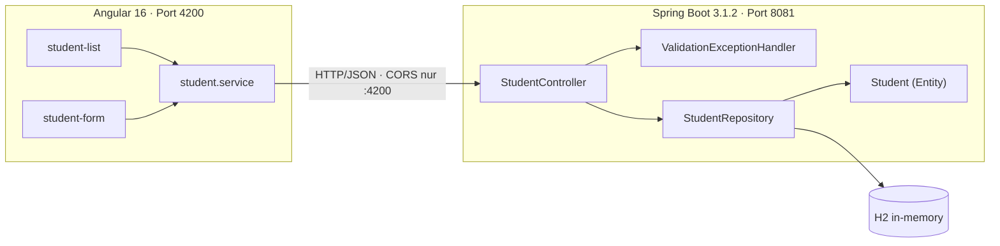

# Testkonzept — Student-Verwaltung

> **Aufgabenstellung**
>
> *Sie schreiben für Ihr Projekt ein entsprechendes Testkonzept. Verwenden Sie dabei
> die wichtigsten Elemente, wie diese in der Theorie beschrieben sind. Das Testkonzept
> sollte nicht zu gross sein und ca. 1-2 Seiten umfassen.*

**Testobjekt:** Student-Verwaltung aus [Kapitel 5](../5-automation-testing/README.md) ·
**Stand:** 07.09.2026 · **Autor:** Leon Wulff

> *Vorläufiges Testobjekt.* Das Modulprojekt ist noch nicht gewählt. Sobald es feststeht,
> wird dieses Konzept darauf umgestellt — die Struktur bleibt gleich.

---

## 1  Zusammenfassung

Die Student-Verwaltung ist eine Webanwendung zum Erfassen und Auflisten von Studenten.
Ein Angular-Frontend spricht über eine REST-Schnittstelle mit einem Spring-Boot-Backend,
das die Daten in einer H2-In-Memory-Datenbank hält. Ein Student besteht aus `id`, `name`
und `email`. Fachlich kann die Anwendung zwei Dinge: **alle Studenten anzeigen** und
**einen Studenten erfassen**. Beim Start werden fünf Datensätze angelegt; nach einem
Neustart ist der Stand wieder frisch.

## 2  Big Picture — Architektur und Test Items

| ID | Test Item | Rolle |
|---|---|---|
| TI-1 | `StudentController` | REST-Schnittstelle `GET /students`, `POST /students`, CORS |
| TI-2 | `ValidationExceptionHandler` | übersetzt Validierungsfehler in HTTP 400 mit Feldmeldungen |
| TI-3 | `Student` (Entity) | Datenmodell und Validierungsregeln (`@NotBlank`, `@Size`, `@Email`) |
| TI-4 | `StudentRepository` | Datenzugriff über `CrudRepository` |
| TI-5 | `student-list` / `student-form` | Anzeige und Erfassung im GUI |
| TI-6 | `student.service` und Routing | HTTP-Anbindung und Navigation des Frontends |
| TI-7 | H2-Datenbank | Persistenz während der Laufzeit |

## 3  Test Features — was getestet wird

| Feature | Test Item | Stufe |
|---|---|---|
| Alle Studenten lesen, Antwortformat und Contract einhalten | TI-1, TI-4 | API |
| Student anlegen, id-Vergabe durch die Datenbank | TI-1, TI-3 | API |
| Fehlerhafte Anfragen: kaputtes JSON → 400, falscher Content-Type → 415 | TI-1 | API |
| CORS: nur Port 4200 erlaubt; unbekannte Routen → 404 | TI-1 | API |
| Eingabevalidierung: Pflichtfelder, E-Mail-Format, Länge, nichts speichern bei Ablehnung | TI-2, TI-3 | API |
| Liste zeigt Backend-Daten in den richtigen Spalten | TI-5 | E2E |
| Erfassung: Submit-Sperre, Durchstich Formular → Liste → API, Persistenz nach Reload | TI-5, TI-6, TI-7 | E2E |
| Formularmeldungen und Anzeige von Backend-Fehlern | TI-2, TI-5 | E2E |
| Antwortzeit- und Fehlerverhalten unter Last | TI-1, TI-4, TI-7 | Last |

## 4  Features not to be tested — was bewusst nicht getestet wird

| Nicht getestet | Begründung |
|---|---|
| Spring Data JPA, Hibernate, Angular-Framework | Framework-Code — Tests dafür prüfen fremde Bibliotheken, nicht unseren Code |
| Browser-Kompatibilität | E2E läuft ausschliesslich auf Chromium; Firefox, WebKit und mobile Viewports sind nicht konfiguriert |
| Barrierefreiheit und Usability | keine Anforderung formuliert, kein Werkzeug im Einsatz |
| Authentifizierung und Autorisierung | die Anwendung hat kein Benutzerkonzept; geprüft wird nur die CORS-Regel |
| Dauerlast über Stunden | die Lastszenarien laufen 10 bis 56 Sekunden; Memory Leaks werden so nicht sichtbar |
| Verhalten bei Datenbankausfall | H2 läuft in-memory im selben Prozess, ein isolierter Ausfall ist nicht herstellbar |

## 5  Testvorgehen — Test Driven Development

Die Weiterentwicklung erfolgt nach **TDD** im Zyklus **Red → Green → Refactor**:

1. **Red** — zuerst der Test für die neue Anforderung. Er muss fehlschlagen; ein Test, der
   von Anfang an grün ist, prüft nichts.
2. **Green** — die einfachste Implementierung, die den Test grün macht.
3. **Refactor** — aufräumen, während die Tests das Verhalten absichern.

Ergänzend gilt:

* **Unit- und Komponententests** mit JUnit 5. Abhängigkeiten werden mit **Mockito**
  durch Test Doubles ersetzt (`@Mock`, `@InjectMocks`) — Vorgehen aus
  [Kapitel 4](../4-abhaengigkeiten-zu-schnittstellen/README.md).
* **API- und E2E-Tests** mit Playwright, **Lasttests** mit k6.
* **Ist-Zustand zuerst festhalten.** Gefundene Fehler werden erst als Test auf das
  tatsächliche Verhalten dokumentiert und danach behoben.

> **Ehrliche Einordnung:** Die bestehenden 20 Tests sind *nachträglich* zur vorgegebenen
> Anwendung geschrieben worden, nicht nach TDD. TDD gilt ab der Weiterentwicklung — beim
> Feature „Eingabevalidierung" wurde bereits so gearbeitet: erst die Tests auf das
> gewünschte 400-Verhalten umgestellt, dann implementiert.

## 6  Kriterien für erfolgreiche und nicht-erfolgreiche Tests

| Stufe | Bestanden | Fehlgeschlagen |
|---|---|---|
| Unit / API / E2E | alle Zusicherungen treffen zu | eine Zusicherung schlägt fehl oder der Test läuft in den Timeout |
| Last | alle k6-Thresholds eingehalten | ein Threshold gerissen → Exit-Code 99, Pipeline rot |

Lastschwellen: unter 1 % HTTP-Fehler, p95 < 500 ms, p99 < 1000 ms, Check-Rate > 99 %.

**Fehlerklassifikation:** geringfügig (läuft mit Mängeln) · mittelschwer (offensichtliche
Fehler) · schwerwiegend (Absturz). Bisher wurde **kein schwerwiegender** Fehler gefunden —
die Fehlerquote lag in allen Lastszenarien bei 0,00 %.

## 7  Testumgebung

| | |
|---|---|
| Laufzeit | JDK 17 oder 21 (Lombok auf 1.18.34 gepinnt), Node.js 18+ |
| Anwendung | Spring Boot 3.1.2, Angular 16.2, H2 in-memory |
| Ports | Backend 8081, Frontend 4200 |
| Unit / Mocking | JUnit 5, Mockito |
| API und E2E | Playwright 1.49 mit Chromium — startet beide Server bei Bedarf selbst |
| Last | k6 v2.2.0 |
| Reports | Playwright-HTML-Report; Trace, Screenshot und Video bei Fehlschlag; k6-Zusammenfassung als JSON |
| Hardware | Entwicklungsrechner Windows 11; Last und System auf derselben Maschine — absolute Messwerte sind nicht auf Produktion übertragbar |

## 8  Kurze Planung

Getestet wird ereignisgesteuert, nicht nach Kalender — schnelle Tests zuerst:

| Auslöser | Was läuft | Dauer |
|---|---|---|
| Während der Entwicklung (TDD-Zyklus) | der jeweilige Unit-Test | Sekunden |
| Nach jeder Codeänderung | API-Tests (`npm run test:api`) | Sekunden |
| Vor jedem Commit | alle Tests (`npm test`) | ~6 s |
| Nach Änderungen an Controller, Entity oder Repository | zusätzlich `mvn test` | ~10 s |
| Vor der Abgabe | k6-Szenarien smoke, load, stress | 10 s / 56 s / 51 s |
| Bei einem Befund | Ist-Zustand als Test festhalten → beheben → Test auf Soll-Verhalten umstellen | — |

Der Lasttest erzeugt Daten und läuft deshalb zuletzt, gegen ein frisch gestartetes Backend.
